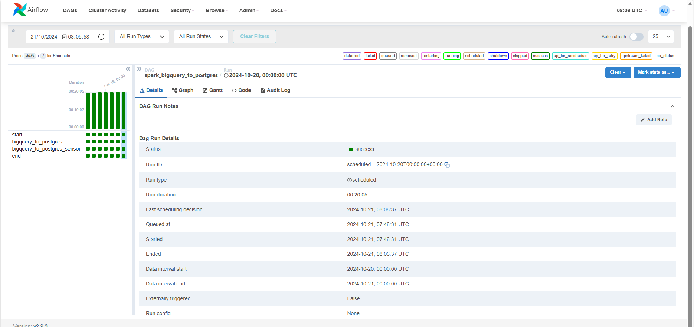

## Visão Geral

Este projeto tem como objetivo construir uma solução de processamento de dados no Kubernetes utilizando Minikube como cluster local. A pipeline coleta dados de uma tabela pública do BigQuery e os grava em um banco de dados PostgreSQL, utilizando Spark para processamento e Airflow para orquestração das tarefas.

## Ferramentas Utilizadas

- **Docker**: Para gerenciar contêineres e imagens.
- **Helm**: Para gerenciar pacotes do Kubernetes.
- **Terraform**: Para automação da infraestrutura como código (IaC).
- **Minikube**: Para criar um cluster Kubernetes local.
- **VS Code/OpenLens/DBeaver**: Ferramentas de desenvolvimento com extensões para facilitar o gerenciamento de Kubernetes e edição de código.
- **Airflow**: Para orquestrar o pipeline de dados.
- **Spark**: Para processar dados com alta performance.
- **Google BigQuery**: Fonte de dados utilizada (dataset público).
- **GitHub**: Repositório onde os DAGs e scripts de processamento são versionados.
- **PostgreSQL**: Banco de dados para persistir os dados processados.

## Passo a Passo para Configuração e Deploy

### 1. Instalação de Pré-requisitos

Instalar as seguintes ferramentas na máquina local:
- Docker
- Helm
- Terraform

### 2. Clonar o Repositório

Clone o repositório do projeto:
```bash
git clone -v --no-checkout -b develop https://github.com/rafaelsmf/contratos-inteligentes-eth.git
```

### 3. Deploy do Cluster Minikube
Navegue até a pasta infrastructure/minikube e inicialize o Terraform para criar o cluster Minikube:

```bash
Copiar código
cd infrastructure/minikube
terraform init
terraform plan
terraform apply
```

Obs: verifique se será necessário aumentar/diminuir os recursos (memória e cpu)

### 4. Iniciar o Tunnel do Minikube
Abra uma nova janela de terminal e execute o comando para iniciar o Minikube Tunnel:

```bash
Copiar código
minikube tunnel -p local-k8s
```

### 5. Deploy dos Recursos Kubernetes
Depois de configurar o Minikube, navegue para a pasta k8s/ e faça o deploy dos recursos do Kubernetes com Terraform:

```bash
Copiar código
cd ../k8s/
terraform init
terraform plan
terraform apply
```
Observação: Aguarde que todas as aplicações estejam executando para seguir para os próximos passos

#### Crie uma nova conexão no Airflow
1. Em um terminal, execute o comando abaixo:
```
kubectl config set-context local-k8s
```
2. Faça port-forward no webserver do Airflow:
```
kubectl port-forward pods/airflow-webserver-88f9bf489-ld79f 8080:8080 -n airflow
```

3. Dados de Acesso
- Login: admin
- Password: admin

4. Adicione uma nova conexão no Airflow
- Admin -> Connections:


5. Ative a DAG:


6. Resultado da execução da DAG dos últimos 7 dias:


### 6. Verificando os dados escritos no Postgres
1. Execute o comando em um novo terminal
```
kubectl port-forward pods/postgres-0 5432:5432 -n postgres
```

2. Acesse o DBeaver ou outra IDE similar

3. Cria a conexão no banco Postgres
```
user: admin
password: admin
```


4. Execute uma consulta na tabela
```
select *
from public.crypto_tokens
limit 1000
```

5. Dados Escritos:


### 6. Comentários

# DAG do Airflow responsável pela orquestração


1. Extração: O Spark conecta-se ao BigQuery e faz a leitura dos dados do dataset público de transações de Ethereum.
2. Processamento: O Spark realiza o processamento, aplicando filtros baseados na data da execução (D-1) para realizar um processamento incremental.
3. Armazenamento: O Spark grava os dados processados no banco de dados PostgreSQL em execução no Minikube.

# Desafios Encontrados

1. Configuração do Spark Operator
- A configuração inicial do Spark Operator no Minikube apresentou desafios, principalmente ao lidar com incompatibilidades na versão do jar do conector do BigQuery. Para sanar esse problema, criei uma nova imagem do spark adicionando as dependências diretamente na pasta de jars.
2. Autenticação com o BigQuery
- As credenciais de autenticação foram armazenadas como secrets no Kubernetes, garantindo segurança e fácil integração com o BigQuery.
3. Orquestração com Airflow
- O Airflow foi configurado com Git-Sync para garantir a sincronização contínua das DAGs diretamente do GitHub.
4. Gravação no PostgreSQL
- Foi possível validar o processo ponta a ponta desde a coleta, processamento e escrita no Postgres.