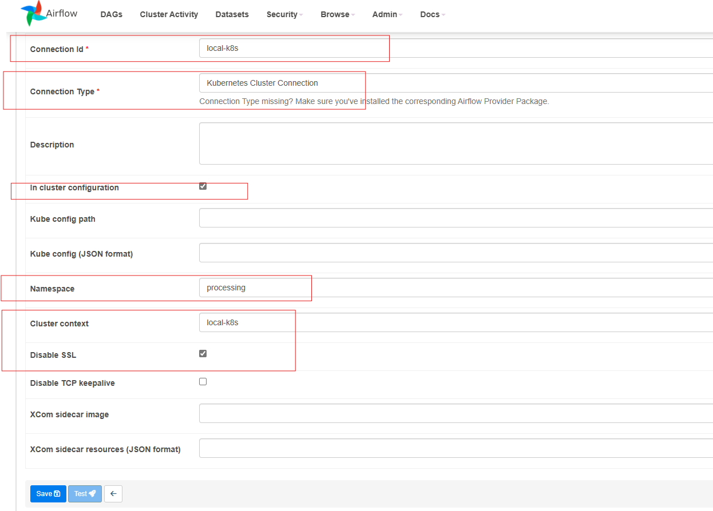

## Visão Geral

Este projeto tem como objetivo construir uma solução de **processamento de dados** no Kubernetes utilizando **Minikube** como cluster local. A pipeline coleta dados de uma tabela pública do **BigQuery** e os grava em um banco de dados **PostgreSQL**, utilizando **Spark** para processamento e **Airflow** para orquestração das tarefas.

## Ferramentas Utilizadas

- **Docker**: Gerenciamento de contêineres e imagens.
- **Helm**: Gerenciamento de pacotes no Kubernetes.
- **Terraform**: Automação da infraestrutura como código (IaC).
- **Minikube**: Criação de um cluster Kubernetes local.
- **VS Code/OpenLens/DBeaver**: Ferramentas de desenvolvimento e gerenciamento de Kubernetes, além de edição de código.
- **Airflow**: Orquestração do pipeline de dados.
- **Spark**: Processamento de dados de alta performance.
- **Google BigQuery**: Fonte de dados (dataset público).
- **GitHub**: Repositório de versionamento dos DAGs e scripts de processamento.
- **PostgreSQL**: Banco de dados utilizado para persistência dos dados processados.

## Passo a Passo para Configuração e Deploy

### 1. Instalação de Pré-requisitos

Instale as seguintes ferramentas na máquina local:
- Docker
- Helm
- Terraform

### 2. Clonar o Repositório

Clone o repositório do projeto:

\`\`\`bash
git clone -v --no-checkout -b develop https://github.com/rafaelsmf/contratos-inteligentes-eth.git
\`\`\`

### 3. Deploy do Cluster Minikube

Navegue até a pasta **infrastructure/minikube** e inicialize o **Terraform** para criar o cluster Minikube:

\`\`\`bash
cd infrastructure/minikube
terraform init
terraform plan
terraform apply
\`\`\`

> **Observação**: Verifique a necessidade de ajustar os recursos (memória e CPU) do Minikube conforme as especificações da sua máquina.

### 4. Iniciar o Tunnel do Minikube

Abra uma nova janela de terminal e execute o comando para iniciar o tunnel do Minikube:

\`\`\`bash
minikube tunnel -p local-k8s
\`\`\`

### 5. Deploy dos Recursos no Kubernetes

Após a configuração do Minikube, navegue para a pasta **k8s/** e faça o deploy dos recursos no Kubernetes usando o **Terraform**:

\`\`\`bash
cd ../k8s/
terraform init
terraform plan
terraform apply
\`\`\`

> **Observação**: Aguarde até que todas as aplicações estejam rodando antes de prosseguir.

### 6. Configuração do Airflow

#### Criar uma nova conexão no Airflow

1. Em um terminal, execute o seguinte comando para configurar o contexto do Kubernetes:

\`\`\`bash
kubectl config set-context local-k8s
\`\`\`

2. Faça um port-forward no **webserver** do Airflow:

\`\`\`bash
kubectl port-forward pods/airflow-webserver-88f9bf489-ld79f 8080:8080 -n airflow
\`\`\`

3. **Acessar o Airflow**:
   - **Login**: \`admin\`
   - **Password**: \`admin\`

4. **Adicionar uma nova conexão no Airflow**:
   - Navegue para **Admin -> Connections**:
     

5. **Ativar a DAG**:
   

6. **Verificar a execução da DAG (últimos 7 dias)**:
   

### 7. Verificando os Dados Gravados no PostgreSQL

1. Execute o comando em um novo terminal para acessar o PostgreSQL:

\`\`\`bash
kubectl port-forward pods/postgres-0 5432:5432 -n postgres
\`\`\`

2. Abra o **DBeaver** (ou uma IDE similar) e crie uma nova conexão com o PostgreSQL:
   - **Usuário**: \`admin\`
   - **Senha**: \`admin\`
   

3. Execute a consulta SQL para verificar os dados gravados:

\`\`\`sql
SELECT * 
FROM public.crypto_tokens
LIMIT 1000;
\`\`\`

4. **Dados Gravados**:
   

### 8. Pipeline do Airflow

- **Pipeline** (DAG do Airflow) responsável pela orquestração:
  

#### Passos da Pipeline:
1. **Extração**: O **Spark** conecta-se ao **BigQuery** e lê os dados do dataset público de transações de Ethereum.
2. **Processamento**: O Spark realiza o processamento dos dados, aplicando filtros baseados na data de execução (D-1) para realizar o processamento incremental.
3. **Armazenamento**: O Spark grava os dados processados no **PostgreSQL** rodando no Minikube.

### Desafios Encontrados

1. **Configuração do Spark Operator**:
   - A configuração inicial do Spark Operator no Minikube apresentou desafios, especialmente ao lidar com incompatibilidades de versões do jar do conector do BigQuery. Para resolver, foi criada uma nova imagem do Spark com as dependências adicionadas diretamente na pasta de jars.

2. **Autenticação com o BigQuery**:
   - As credenciais de autenticação foram armazenadas como **secrets** no Kubernetes, garantindo segurança e fácil integração com o BigQuery.

3. **Orquestração com o Airflow**:
   - O Airflow foi configurado com **Git-Sync** para garantir a sincronização contínua das DAGs diretamente do GitHub.

4. **Gravação no PostgreSQL**:
   - O processo de validação da gravação no Postgres foi completado com sucesso, comprovando o fluxo ponta a ponta desde a coleta até o armazenamento dos dados processados.